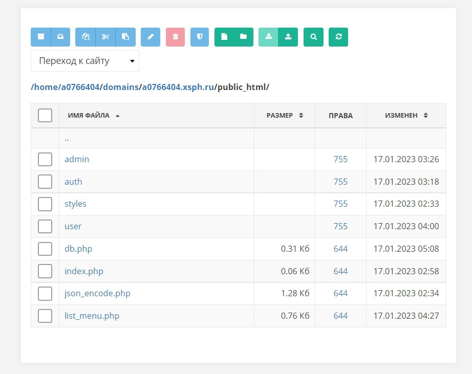

# Отчёт о курсовой работе
#### *По курсу Основы Программирования*
#### *Работу выполнил студент группы №3131 Брусланов Дмитрий*

## Изучение предметной области

Сайты ресторанов часто оказываются неудобными.
Чтобы понять где находится сам ресторан, приходится искать его по названию в онлайн-картах или по его адресу.

Почему бы не сделать сайт ресторана, на котором можно было бы посмотреть месторасположение ресторана на карте, а также удобно сделать заказ.

## Составление ТЗ

- Базовая система авторизации и выхода из аккаунта
- Нормальный внешний вид без несочетающихся ярких цветов, мозолящих глаз
- Возможность посмотреть номера всех своих заказов
- Админка с возможностью добавления, редактирования и удаления блюд
- Отображение карточек блюд без лишней перезагрузки страницы

## Выбор технологий

#### *Платформа:*
Бесплатный хостинг **free.sprinthost.ru**

#### *Среда разработки:*
Sublime Text.

#### *Языки программирования:*
PHP, JavaScript.

#### *Фреймфорки:*
Bootstrap

#### *Библиотеки:*
Конструктор Яндекс карт

## Реализация

### Пользовательский интерфейс:
- *Форма авторизации:*

- *Интерфейс основной страницы* 

- *Интерфейс админки* 

### Пользовательский сценарий:

Пользователь заходит на сайт, его перекидывает на форму входа *(login.php)*. Там пользователь входит в свою учётную запись, или переходит на *(signin.php)*, где регистрирует аккаунт при необходимости предварительно зарегистрировавшись. После входа он попадает на главную страницу *(catalog.php)* ил на *(root.php)*, если у аккаунта есть доступ к админке.
На странице *(catalog.php)* пользователь может

- Выйти из учётной записи и попасть обратно на форму входа
- Выбрать блюдо и добавить в заказ
- Оформить заказ
- Посмотреть номера своих заказов
- Посмотреть расположение ресторана на Яндекс картах и открыть ресторан в Яндекс картах

На странице *(root.php)* пользователь (админ) может

- Выйти из учётной записи и попасть обратно на форму входа
- Выбрать карточку блюда и изменить его данные
- Удалить или добавить новую карточку блюда

### API сервера:

При регистрации/авторизации пользователя используются **GET**-запросы с полями *login* и *pass* 

Для отображения карточек товаров, карт и таблицы заказов используются  **fetch()**-запросы

### Хореография 

**catalog.php** и **catalog.php** при отсутствии куки перенаправляют пользователя на страницу **login.php**. Если куки есть и они корректны, то перенаправление не происходит.

При нажатии кнопки **"Войти""**, **login.php** перенаправляет **GET()**-запрос с введёнными данными на **login_processing.php**, который соединяется с базой данных и сверяет данные и в случае успеха устанавливает куки и перенаправляет пользователя на  **catalog.php**. 

### Структура базы данных

База данных состоит из 3-х таблиц

**users** имеет столбцы **login**, **pass** (хэш пароли), **root** (право доступа)

**orders** имеет столбцы **name**, **number_order**

menu имеет столбцы **type**, **img**, **descr**, **price**, **id**

### Алгоритмы

### Пример HTTP запросов/ответов

### Значимые фрагменты кода
**fetch()**-запрос при для получения данных о карточках блюд:
        fetch('/course_work/list_menu.php')
        .then(response => response.json())
        .then(data => {
            if (!data.status) {
                console.log(data);
                return;
            }
            createMenuCard(data.data);
        })
        .catch(error => {
            console.log(error);
        });
Отображение карточек блюд:
const obj = document.getElementById('17');
	arr.forEach(item => {
		const new_col = document.createElement('div');
		new_col.setAttribute('class', 'col');
		new_col.setAttribute('id', 'col-'+item.id);
		let a = 0;
		new_col.innerHTML=`
						

				            
				            
${a}

				            

				              <h5 class="card-text">${item.type}</h5>
				              
${item.descr}

				              

				                

				                  <button type="button" onclick="add_to_list(${item.id})" class="btn btn-sm btn-outline-secondary">Добавить</button>
				                  <button type="button" onclick="remove_from_list(${item.id})" class="btn btn-sm btn-outline-secondary">Убрать</button>
				                

				                <small class="text-muted">${item.price}</small>
				              

				            

				          
`
				        obj.appendChild(new_col);            
	});

**fetch** запрос для изменения к/т:

    price.addEventListener('click', (e) => {
        e.preventDefault();
        fetch('/course_work/admin/update_menu.php?column=price&value='+iprice.value+'&id='+id)
        .then(response => response.json())
        .then(data => {
            if (!data.status) {
                console.log(data);
                return;
            }
            let ad_price = document.getElementById('adres_price'+id);
            ad_price.innerHTML=`${iprice.value}`;
        })
        .catch(error => {
            console.log(error);
        });

});

**fetch** запрос для получения данных о заказах к/т::

    let name = document.getElementById('order_getter');
	let text = name.getAttribute('value');
	fetch('/course_work/user/list_order.php?name='+text)
		.then(response => response.json())
		.then(data => {
			if (!data.status) {
                console.log(data);
                return;
            }
            create_order(data.data)
		})
		.catch(error => {
            	console.log(error);
        	});

## Тестирование

Хэддер главной страницы:

Окно редактирования блюда:

Окно добавления блюда:

Всё работает!

## Внедрение

 #### Файлы на хостинге:                      
 
 
 #### БД на хостинге:                  
 
 
## Поддержка
Не требуется, администрирование осуществляется через хостинг.
